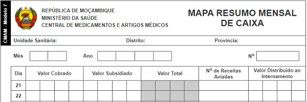

# Totalizador de Mapa Resumo Mensal de Caixa

O **Totalizador de Mapa Resumo Mensal de Caixa** é um serviço online gratuito que auxilia na elaboração, como o nome sugere, do mapa resumo mensal de caixa, por meio do cálculo automático dos totais com base nos dados preenchidos pelo usuário. Foi criado de acordo com o modelo da ficha de mapa resumo mensal de caixa actualmente vigente no Serviço Nacional de Saúde em Moçambique.

## Objectivos

* Auxiliar os Profissionais de Saúde na totalização do mapa resumo mensal de caixa com exatidão e prontidão;

* Minimizar possíveis erros de totalização;

* Expandir o acesso à ficha de mapa resumo mensal de caixa.

## O que eu preciso dispor para, e como utilizar o totalizador?

* Um celular ou computador com acesso à internet.

* Para cada variável (Valor cobrado e Subsidiado), preencher os valores correspondentes em função dos dias do mês em reporte e consequentemente os respectivos totais são, em tempo real, correcta e automaticamente calculados.

## Qual é o destino dos dados que eu insiro?

São guardados localmente (no navegador que estiver a usar), por meio de um recurso chamado [Web Storage](https://developer.mozilla.org/pt-BR/docs/Web/API/Web_Storage_API) e você tem total controle sobre esses, podendo mantê-los ou apagá-los por meio da opção "Esvaziar ficha" no menu do totalizador ou esvaziando o histórico (inclusíve os cookies) do seu navegador.

## Vantagens do totalizador

* Calcula automaticamente os totais;

* Preenche automaticamente as células correspondentes aos totais;

* Fornece resultados (totais) exactos;

* Flexibiliza a elaboração do resumo;

* Pode ser impresso, inclusíve como uma simples ficha de mapa resumo mensal de caixa;

* Pode ser guardado como PDF.